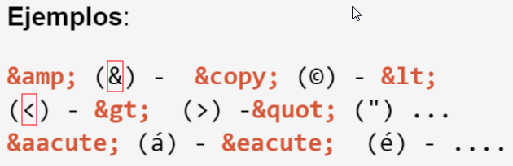

# HTML y CSS

#### HTML <hr>
+ `HyperText Markup Language` especifica el formato de las páginas web, separando el contenido de las páginas de su formato de presentación.

+ Fue creado en los laboratorios CERN por Tim Berners-Lee.

+ Define un conjunto de símbolos (etiquetas o tags) que especifican la estructura lógica de un documento y de todos sus componentes.

+ Es independiente de la plataforma.

+ Su código es interpretado por los clientes web.

<br><br>

#### XHTML <hr>

`XHTML` es una versión más estricta y limpia de HTML , que nace precisamente con el objetivo de reemplazar a HTML ante su limitación de uso con las cada vez más abundantes herramientas basadas en XML. XHTML extiende HTML 4.0 combinando la sintaxis de HTML, diseñado para mostrar datos, con la de XML, diseñado para describir los datos.
<br><br>
#### DOCTYPE <hr>

+ Cuando escribimos nuestro documento HTML, lo primero que tenemos que escribir es el doctype. El doctype es la declaración de tipo de documento. En otras palabras, el doctype nos sirve para indicar que nuestro documento está escrito siguiendo la estructura determinada por un DTD concreto.

+ Indica la forma en que se validará el documento.

+ `HTML5`:

```
<!DOCTYPE html>
```
<br><br>
#### META <hr>

+ . Los meta tags se insertan en la cabecera de la página, entre las etiquetas <head></head>. La función de estos tags varía.

+ Pueden ser informativos, para los buscadores y usuarios, indicándoles el tipo de contenido de la web, sus palabras claves, etc. o pueden predefinir una actuación a la página.

+ Los meta tags no se pueden ver a no ser que sea a través del código fuente. Es decir, un meta tag no hace variar la apariencia de una página web, pero son imprescindibles e importantísimos para los buscadores webs.

+ Son usados, entre otras cosas, por buscadores para mejorar la calidad de los resultados en las búsquedas.

+ El esquema de un meta tag es el siguiente:

 ```
<meta name=" " content=" "/>
```

+ El <code>name</code> muestra el nombre de la etiqueta y el <code>content</code> el contenido de esa etiqueta. Los meta tags pueden cerrarse de dos formas: > o /> . La segunda es más correcta aunque los navegadores no muestran diferencia con una u otra.

+ **meta tag para que los robots de búsqueda no indexen las imágenes del sitio**:

```
<meta name="robots" content="noimageindex">
```

+ **meta tag para que los robots indexen el sitio pero no los links del sitio**:

```
<meta name="robots"  content="nofollow">
```

+ **meta tag para indicar que hoja de estilo se usará**:

```
 <meta http-equiv="Content-Style-Type" content="text/css">
```

+ **meta tag para indicar que se cambia la hoja de estilo para imprimir**

```
 <meta http-equiv="Content-Style-Type" media="print" content="print/css">
```

+ **meta tag el lenguaje por defecto será JavaScript**

```
<meta http-equiv="Content-Script-Type" content="text/javascript">
```
<br><br>
#### Formas de agregar estilos a una página <hr>

+ Mediante URL a el archivo `CSS` con la etiqueta <code>link</code>
+ Mediante la etiqueta <code>style</code>
+ Atributo `style` sobre tag `HTML` <code><etiqueta style=“prop1:valor1; prop2:valor2; ...”></etiqueta></code>

Siempre conviene desde un archivo apartado `.css`.
<br><br>
#### Entidades HTML <hr>

+ Se las utiliza para representar símbolos especiales que no son representados de la misma manera en todos los set de caracteres: símbolos matemáticos, caracteres especiales, letras acentuadas, etc.

+ Permite independizarmns del set de caracteres del navegador

+ Forma general: <code>&nombreEntidad;</code>
<br><br>


#### Semántica Web <hr>

+ Es un concepto que involucra la incorporación de metadatos para agregar significado a la información del documento HTML.

+ Se debe seguir un formalismo adecuado para que se lo pueda procesar en forma adecuada

+ **Contenidos semánticos**: `HTML5` introdujo elementos estructurales:<code> <article>, <header>, <footer>, <nav>, <section> </code>
<br><br>
#### Microformatos <hr>

+ Son un conjunto de variables que se agregan a las etiquetas HTML existentes, y que entregan información detallada acerca de las características del contenido que contienen. Por ejemplo, diciendo a los buscadores y navegadores que esta página es un artículo de noticias, que el H1 es el título, que la bajada está en una viñeta y dónde está el contenido de la noticia.
<br><br>
#### CSS3 <hr>

+ En CSS3, la especificación se dividió en una colección de especificaciones más pequeñas, conocidas como módulos. Cada modulo define aspectos de funcionalidad dentro de un conjunto. Un modulo se encarga de media selectors, otro de colores, otro de SVG, y así sucesivamente

+ No todos los navegadores soportan todas las características de `CSS3` hay páginas para checkear estas disponibilidades

+ Novedades:
  + Esquinas redondeadas
  + Drop Shadows
  + Opacidad y degradados
  + Transiciones
  + **Media Queries** :
     +  [Ejemplos](http://www.w3schools.com/css/css3_mediaqueries_ex.asp)
     +  [Información](https://developer.mozilla.org/es/docs/CSS/Media_queries)
<br><br>
