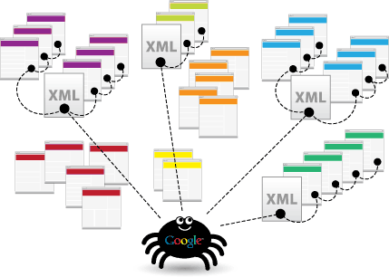

# Motores de Búsqueda
  
##### ¿Qué son los motores de búsqueda? 

Un motor de búsqueda, también conocido como buscador, es un sistema informático que busca archivos almacenados en servidores web gracias a su spider (también llamado araña web).1 Un ejemplo son los buscadores de Internet (algunos buscan únicamente en la web, pero otros lo hacen además en noticias, servicios como Gopher, FTP, etc.) cuando se pide información sobre algún tema. Las búsquedas se hacen con palabras clave o con árboles jerárquicos por temas; el resultado de la búsqueda Página de resultados del buscador es un listado de direcciones web en los que se mencionan temas relacionados con las palabras clave buscadas.

**Algunos buscadores**

+ Ask.com (antiguamente Ask Jeeves)
+ Baidu (China)
+ Bing (antiguamente Live Search)
+ DuckDuckGo
+ Google
+ Yahoo! Search

Pueden influenciar el desarrollo Web ya que asignan puntajes a las búsquedas realizadas y sólo muestran primero los mejores resultados. El puntaje puede estar ligado a las palabras clave, al diseño del sitio y muchísimas más.
  
##### Archivo robots.txt 

Un archivo robots.txt es un archivo que se encuentra en la raíz de un sitio e indica a qué partes no quieres que accedan los rastreadores de los motores de búsqueda. El archivo utiliza el Estándar de exclusión de robots, que es un protocolo con un pequeño conjunto de comandos que se puede utilizar para indicar el acceso al sitio web por sección y por tipos específicos de rastreadores web (como los rastreadores móviles o los rastreadores de ordenador).

[Más información sobre robots.txt](https://support.google.com/webmasters/answer/6062608?hl=es)

  
##### Archivo sitemap.xml 

Un sitemap es un archivo en el que se pueden enumerar las páginas de tu sitio web para informar a Google y a otros motores de búsqueda sobre la organización del contenido del mismo. Los rastreadores web de los motores de búsqueda, por ejemplo, el robot de Google, leen este archivo para rastrear el sitio de forma más inteligente.

Además, tu sitemap puede proporcionar valiosos metadatos asociados a las páginas que enumeras en el sitemap. Los metadatos son información sobre una página web, como, por ejemplo, cuándo se ha actualizado la página por última vez, con qué frecuencia se cambia y la importancia de esta en relación con otras URL del sitio web.

[Más información sobre sitemap.xml](https://support.google.com/webmasters/answer/156184?hl=es)
[Cómo hacer un sitemap](http://www.maestrosdelweb.com/sitemap/)

  

##### WebMasters y Google Analytics 

**Google WebMasters Tools** te permite obtener datos, herramientas y los diagnósticos necesarios para crear y administrar los sitios web y las aplicaciones móviles optimizadas para Google.

**Google Analytics** tiene herramientas que permiten conocer como los usuarios llegan a la página web y qué parámetros de búsqueda utilizaban, entre otros. Permite tener un profundo análisis del tráfico de la página web.

[Más información](https://www.google.com/intl/es_ALL/analytics/features/)
