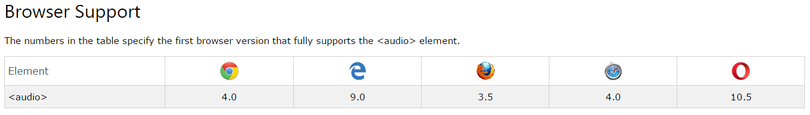

# Audio y Video HTML5

## Audio <hr><br>

```HTML
<audio controls>
  <source src="horse.ogg" type="audio/ogg">
  <source src="horse.mp3" type="audio/mpeg">
  Your browser does not support the audio tag.
</audio>
```



## Video <hr><br>

```HTML
<video width="320" height="240" controls>
  <source src="movie.mp4" type="video/mp4">
  <source src="movie.ogg" type="video/ogg">
Your browser does not support the video tag.
</video>
```


### Conclusiones <hr><br>

+ No todos los navegadores soportan estos tags
+ Sería óptimo brindar un `CSS Reset` para ver que hacer con estos tags en caso de no soportarlos
+ HTML5 brinda estos nuevos tags para tener contenido multimedial en las páginas html fácilmente.
